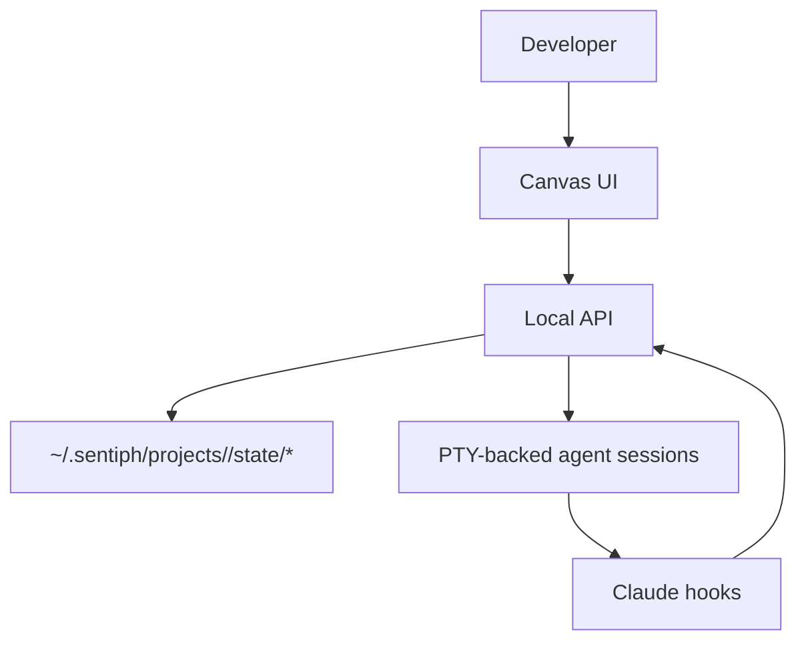

# Mental Model

This page is for the exact model behind `sentiph`. The README is the pitch. This page is the boundary map.

## Architectural layers

`sentiph` separates durable runtime records from live agent execution.

- the **developer** launches agents, reviews output, and decides what lands
- an **agent** is a runtime record plus, when active, one PTY-backed Claude Code session, shown as a color-coded circle node on the canvas
- a **worker** is an agent assigned to one narrower task
- a **parent** is an agent that coordinates workers and performs final review or merge work
- a **channel** is an in-memory queue used to inject short messages into live agent sessions
- a **worktree** is an optional isolated git checkout for an agent

## Agent vs worktree

These are different things.

- an **agent** is a runtime object with a session and a node on the canvas
- a **worktree** is the git isolation layer for that agent

An agent can run in:

- a shared-workspace mode
- a worktree-backed mode

In shared mode, the PTY starts in the main workspace. In worktree mode, the API creates `.sentiph/worktrees/<worktree-id>/` on branch `sentiph/<worktree-id>` and starts the PTY there.

## What belongs in runtime state

The runtime owns:

- agent records and lifecycle state
- live PTY sessions
- websocket transport
- UI state
- transcripts
- message delivery state

Agent records survive API restarts. PTY sessions, WebSocket clients, and channel queues do not.

On startup, `sentiph` reloads agent records from the registry. If a record says it was running, `sentiph` cannot reattach to the old in-memory PTY, so the record is reconciled to `stale` with a lifecycle reason.

## How delegation is supposed to work

The expected flow is:

1. the developer or a parent agent defines a job boundary
2. the parent launches worker agents for narrower tasks
3. each worker receives a prompt that scopes its task, workspace mode, and parent agent ID when present
4. workers report status through short channel messages
5. the parent or human reviews the result

If the boundary is vague, the orchestration gets worse. `sentiph` helps organize work, but it does not rescue a poorly defined job.

## What the project is actually trying to prove

- terminal coding agents can be treated as building blocks inside an orchestration layer
- one Claude Code session can coordinate other Claude Code sessions in a visible way
- a live canvas of agent nodes plus short messages is enough for some useful multi-agent workflows
