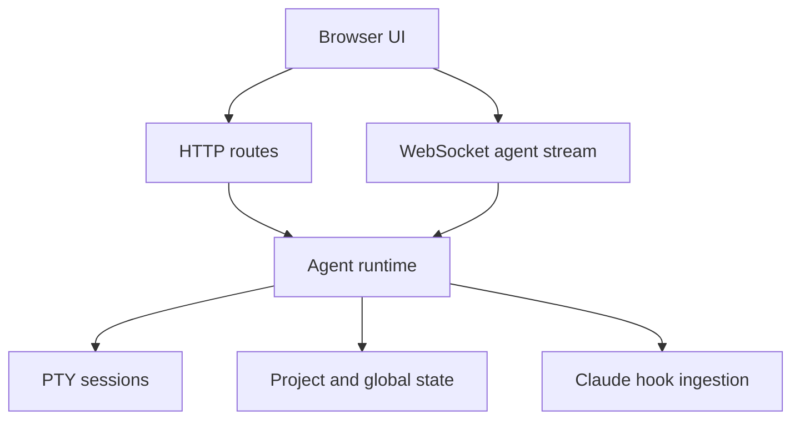

# Runtime And API

`sentiph` runs as a local API with a local web UI on top.

## Runtime shape

## Runtime responsibilities

The API process owns the moving parts that cannot live in static files:

- agent registry loading, migration, and persistence
- PTY lifecycle and scrollback
- WebSocket upgrades for agent IO and agent list events
- Claude hook installation and ingestion
- worktree creation and cleanup for isolated agents
- transcript capture
- in-memory channel queues
- UI state persistence
- Activity data: git summary and Claude/Codex token usage

## Transport model

- HTTP handles CRUD, snapshots, setup checks, and Activity data
- `WS /api/terminals/:terminalId/ws` attaches a browser session to one PTY
- `WS /api/terminal-events/ws` broadcasts agent-created, agent-updated, agent-deleted, and state-change events
- file-backed state is the restart boundary for agent records, UI state, and transcripts

Agent WebSockets do not own the PTY. They are clients attached to a PTY session owned by the API process. When a browser reloads, a new WebSocket can receive scrollback during the idle grace window. When the API restarts, the PTY is gone.

## Security defaults

- binds to `127.0.0.1` by default
- enforces loopback `Host` and `Origin` checks by default
- remote access must be enabled explicitly with `SENTIPH_ALLOW_REMOTE_ACCESS=1`

## Persistence model

- project-local scaffold lives under `.sentiph/`
- runtime state lives under `~/.sentiph/projects/<project-id>/state/`
- transcript events persist independently from PTY scrollback
- PTY sessions do not survive API restarts
- agent records persisted as `running` are reconciled to `stale` on startup when no live session owns them

The agent registry file keeps a historical name for compatibility, but the records it stores are agents. A record stores identity, optional worktree ID, parent agent ID, workspace mode, display name, lifecycle fields, and UI-related metadata such as node color.

## Agent lifecycle

Creating an agent writes a registry record first. If an initial prompt is provided, the runtime immediately starts a PTY session. Otherwise, the PTY starts when a WebSocket or direct listener attaches.

When a PTY starts, `sentiph`:

1. resolves the working directory from the agent workspace mode
2. spawns the user's shell through `node-pty`
3. injects the configured agent bootstrap command
4. optionally pastes and submits an initial prompt
5. writes transcript events and keeps bounded scrollback in memory
6. broadcasts state updates to attached clients

Stopping or killing an agent tears down the active PTY and updates lifecycle metadata. Deleting an agent also cascades to child agents and removes worktrees for worktree-backed records.

## Hook mechanism

For Claude-backed agents, `sentiph` writes hooks into the target `.claude/settings.json`. The hooks call back into the local API and provide state transitions that terminal output alone cannot reliably express.

Hooks currently feed these mechanisms:

- `UserPromptSubmit` marks the agent active and can auto-name generated agents from the first prompt
- `PreToolUse` records the current tool and marks user-question waits
- `Notification` marks permission waits and idle prompts
- `Stop` releases the idle keep-alive

Channel delivery is also tied to hooks. Messages are queued in memory and injected when a target session is idle, including after idle or stop hook events.

## Main API groups

- agents and snapshots
- git and worktrees
- channels
- hook ingestion
- Activity: git summary and token usage
- UI state and setup

For the exact endpoints, see [API reference](../reference/api.md).
